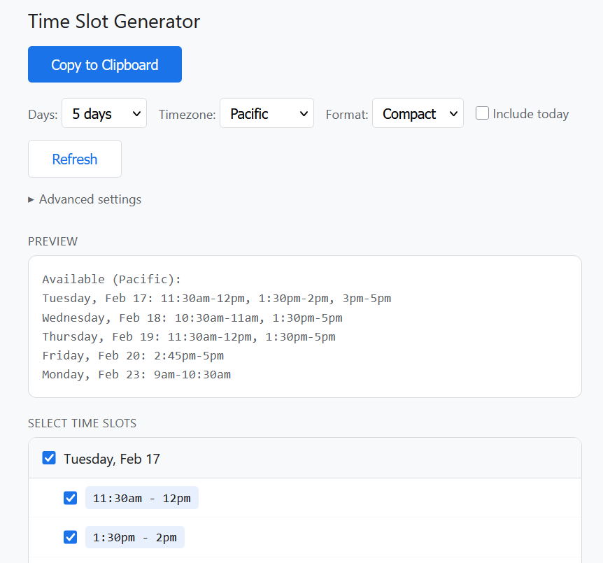
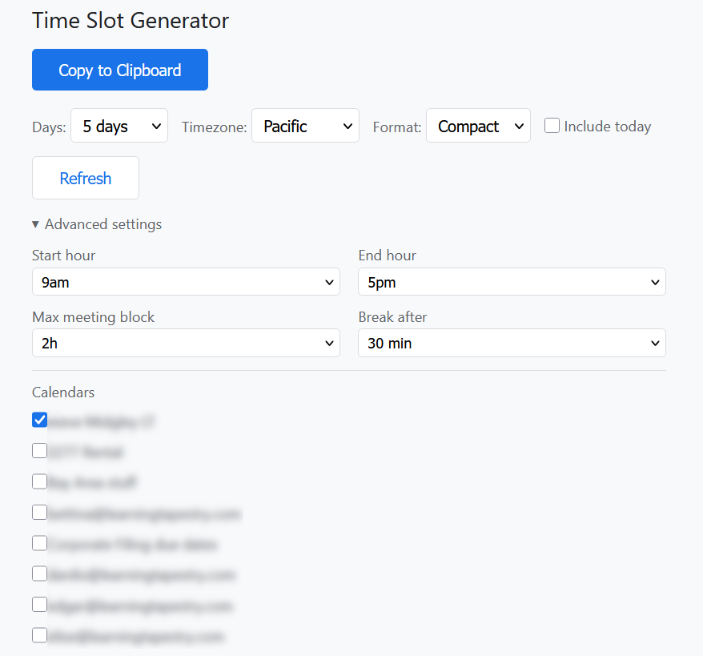

# Google Calendar Time Slot Generator

A Google Apps Script web app that reads your Google Calendar and generates copyable time-slot text for scheduling emails and messages. Instead of going back and forth about availability, open the app, review your free slots, and paste formatted availability into an email or chat.

## Features

- Scans your Google Calendar for the next N business days (3, 5, or 10)
- Computes free time slots within configurable working hours
- **Multi-calendar support** -- select which calendars contribute to busy-time calculation (personal + work, or switch between different people's calendars)
- **Meeting fatigue breaks** -- automatically inserts buffer time after long meeting blocks, with smart gap classification (micro-gaps merge, short gaps may close, real breaks always preserved)
- **Slot rounding** -- round slot start times to clean increments (5, 10, 15, or 30 min) so you never propose a meeting at 2:55pm
- **Timezone display** -- format times in Pacific, Mountain, Central, or Eastern
- **Include today** -- optionally show remaining availability for the current day
- Check/uncheck individual slots or entire days before copying
- Two output formats: bullets (email-friendly) or compact (chat-friendly)
- One-click copy to clipboard

## Screenshots

<p align="center">
  
</p>

The main screen shows a live preview of the formatted availability text at top, with checkboxes below to include or exclude individual time slots and entire days.

<p align="center">
  
</p>

Advanced settings let you configure working hours, meeting fatigue breaks, and which calendars to include in the busy-time calculation.

## Quick Install (No Developer Tools Required)

This method uses only your browser. No Node.js, git, or command line needed.

### 1. Create a new Apps Script project

1. Go to [script.google.com](https://script.google.com) and sign in with your Google account
2. Click **New project**
3. Name it "Time Slot Generator" (click "Untitled project" at the top)

### 2. Add the code files

The pre-built files are in the [`release/`](release/) folder of this repository.

**Replace Code.gs:**

1. In the Apps Script editor, you'll see a file called `Code.gs` with a default `myFunction()` in it
2. Select all the text and delete it
3. Open [`release/Code.gs`](release/Code.gs) in this repository and copy its entire contents
4. Paste into the empty `Code.gs` file in the editor

**Add index.html:**

1. In the left sidebar, click the **+** button next to "Files"
2. Select **HTML**
3. Name it `index` (it will become `index.html`)
4. Delete the default HTML content
5. Open [`release/index.html`](release/index.html) in this repository and copy its entire contents
6. Paste into the empty `index.html` file

**Update appsscript.json:**

1. In the left sidebar, click the **gear icon** (Project Settings)
2. Check the box **"Show 'appsscript.json' manifest file in editor"**
3. Go back to the Editor (left sidebar, `< >` icon)
4. Click on `appsscript.json` in the file list
5. Select all and replace with:

```json
{
  "timeZone": "America/Los_Angeles",
  "dependencies": {},
  "exceptionLogging": "STACKDRIVER",
  "runtimeVersion": "V8",
  "webapp": {
    "executeAs": "USER_DEPLOYING",
    "access": "MYSELF"
  }
}
```

### 3. Deploy as a web app

1. Click **Deploy** > **New deployment**
2. Click the **gear icon** next to "Select type" and choose **Web app**
3. Fill in:
   - **Description**: "Time Slot Generator" (or anything you like)
   - **Execute as**: "Me" (your email address)
   - **Who has access**: "Only myself"
4. Click **Deploy**
5. Click **Authorize access** when prompted
6. In the popup, select your Google account
7. If you see "Google hasn't verified this app", click **Advanced** > **Go to Time Slot Generator (unsafe)** -- this is your own script, so it's safe
8. Click **Allow** to grant calendar read access
9. Copy the **Web app URL** shown -- bookmark this link

### 4. Use it

Open the Web app URL. The app reads your Google Calendar, computes your free time slots, and lets you copy formatted availability text to your clipboard.

## Usage

### Main Controls

| Control | Description |
|---------|-------------|
| **Days** | Number of business days to scan (3, 5, or 10) |
| **Timezone** | Display timezone for formatted times (Pacific, Mountain, Central, Eastern) |
| **Format** | Bullets (multi-line with day headers) or Compact (one line per day) |
| **Include today** | Show remaining free slots for today |

### Advanced Settings

Click "Advanced settings" to expand:

| Control | Description |
|---------|-------------|
| **Start / End hour** | Working hours window (default 9am-5pm) |
| **Max meeting block** | Longest meeting block before a forced break (default 2h, or Off to disable) |
| **Required break** | Minimum gap that counts as a real break, and the duration of enforced breaks after long blocks (default 30 min) |
| **Ignore gaps under** | Gaps this short or shorter are treated as continuous meeting time (default 15 min, or Off) |
| **Round to nearest** | Round slot start times up to the next clean increment (5, 10, 15, or 30 min; default 15) |
| **Calendars** | Select which calendars count toward "busy" time |

### Multi-Calendar

By default, only your primary calendar is checked. To merge availability across multiple calendars:

- **Personal + work**: Check both calendars. Events from all checked calendars are combined -- overlapping events merge naturally, so a meeting on your work calendar and a dentist appointment on your personal calendar both block that time.
- **Admin / assistant use**: If you have view access to other people's calendars, they'll appear in the list. Check one person's calendar at a time to generate their availability.

## Updating to a New Version

When a new version is released, update your Apps Script project to get bug fixes and new features. Your settings are saved automatically and will carry over.

### What's New in v0.3.0

- **Bug fix**: Fatigue breaks no longer incorrectly block time after real breaks between meetings. Previously, a gap between meetings (e.g., free from 2:55pm) could be pushed to 3:25pm because the system treated the break as continuous meeting time.
- **Slot rounding**: Slot start times are now rounded up to clean increments (default 15 min), so you won't see awkward times like 2:55pm — it becomes 3:00pm instead. Configurable to 5, 10, 15, or 30 minutes in Advanced settings.
- **Clearer labels**: "Break after" is now "Required break" and "Min gap for break" is now "Ignore gaps under" to better describe what they do.

### How to Update

1. Open your Apps Script project at [script.google.com](https://script.google.com)
2. Click on `Code.gs` in the file list
3. Select all (`Ctrl+A`) and delete
4. Open [`release/Code.gs`](release/Code.gs) in this repository, copy the entire contents, and paste
5. Click on `index.html` in the file list
6. Select all (`Ctrl+A`) and delete
7. Open [`release/index.html`](release/index.html) in this repository, copy the entire contents, and paste
8. Click **Deploy** > **Manage deployments**
9. Click the **pencil icon** on your existing deployment
10. Change **Version** to "New version"
11. Click **Deploy**

Your bookmarked URL stays the same — just reload the page to see the updated app.

---

## Developer Setup

If you want to modify the code, run tests, or set up automated deployments, use the developer workflow below.

### Prerequisites

- **Node.js** 18+ and npm
- A **Google account** with Google Calendar

### Install

```bash
git clone <your-repo-url>
cd gcal-timeslot-generator
npm install
```

### Configure clasp

```bash
cp .clasp.json.example .clasp.json
```

Edit `.clasp.json` and replace `YOUR_SCRIPT_ID_HERE` with your Script ID (found under Project Settings > IDs in the Apps Script editor):

```json
{
  "scriptId": "your-actual-script-id-here",
  "rootDir": "dist"
}
```

### Authenticate

```bash
npm run login
```

### Build, Push, and Deploy

```bash
npm run deploy
```

This compiles TypeScript, bundles with Rollup, pushes to Apps Script, creates a new version, and updates the web app deployment.

### Scripts

| Command | Description |
|---------|-------------|
| `npm test` | Run Jest unit tests (79 tests) |
| `npm run build` | Compile and bundle to `dist/` and `release/` |
| `npm run push` | Build and push to Apps Script |
| `npm run deploy` | Build, push, create version, update deployment |
| `npm run watch` | Watch mode for development |
| `npm run login` | Authenticate clasp with Google |
| `npm run open` | Open the web app in your browser |

### Project Structure

```
src/
  server/
    Code.ts             Entry point (doGet, getSlots, getCalendars)
    SlotCalculator.ts   Core availability computation
    Formatter.ts        Text formatting (bullets, compact)
  shared/
    types.ts            TypeScript interfaces
  pages/
    index.html          Web UI (HTML + CSS + JS)
tests/
  server/               Jest unit tests
scripts/
  deploy.js             Deployment automation
release/                Pre-built files for non-developer install
dist/                   Build output (pushed to Apps Script)
```

### Architecture

The app runs as a Google Apps Script web app. `Code.ts` is the entry point. The build process (Rollup) bundles all server TypeScript into a single `Code.gs` file and strips ES module syntax (Apps Script runs everything in a shared global scope). The `index.html` is served by `HtmlService`.

Pure computation functions (`mergeBusyBlocks`, `computeFreeSlots`, `applyFatigueBreaks`, `filterPastSlots`, `roundSlotStarts`) are exported and unit-tested with Jest. The `getAvailableSlots` wrapper calls the Google Calendar API and is not unit-tested (requires the GAS runtime).

### Running Tests

```bash
npm test
```

Tests cover all pure computation and formatting functions. `jest.useFakeTimers()` is used for date-dependent logic.

---

## Distribution Options

### Current: Copy-Paste Install

The `release/` folder contains pre-built files that anyone can copy into a new Apps Script project via the browser. No developer tools required. See [Quick Install](#quick-install-no-developer-tools-required) above.

### Future: Google Workspace Marketplace

Publishing to the [Google Workspace Marketplace](https://workspace.google.com/marketplace) would allow one-click installation. However, this app requires calendar read access, which Google classifies as a **restricted OAuth scope**. Restricted scopes require:

- A Google Cloud project with OAuth consent screen
- A third-party security assessment (CASA Tier 2), which costs **$15,000 - $75,000**
- Google's app review process

This makes Marketplace publishing impractical for a free personal tool. The copy-paste install is the recommended distribution method.
